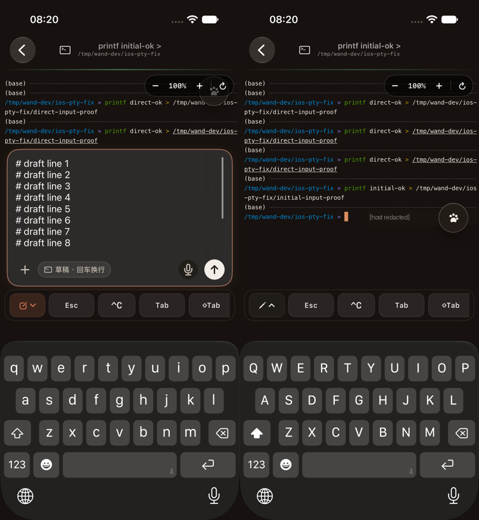

# PTY 多行草稿与终端直通输入验收

## 交互

- 点击终端：在网页的同步用户手势内恢复 xterm 并聚焦，原生草稿抽屉收起但保留内容。
- 点击左下角铅笔：打开草稿编辑，暂停 xterm 输入；软键盘回车换行，↑ 发送。外接键盘原有发送快捷键不变。
- 草稿按实际宽度测量、随内容增高，最高 160pt（小视口进一步限制），超出后内部滚动。
- 抽屉、键盘与草稿高度变化都会重新 fit 终端；旋转/分屏会重新测量文字。
- 保留 PTY 文本、回车 `\r` 分包协议，不改 runner 或输入传输。

## 证据

Xcode 27 / iOS 27 模拟器 **Wand Debug**（iPhone 17 Pro），连接隔离打包服务器，创建 `sessionKind=pty` 的真实 shell。

1. 单击初始终端后出现软键盘，直接输入命令写入 `initial-input-proof`，服务端文件内容为 `initial-ok`。
2. 打开草稿，逐字输入 12 行；断言完整字符串完全相等（包含首字符），输入框高度超过两行，上下滑动能看到第 1 行与第 12 行。
3. 点击终端切回直通，断言软键盘仍存在，输入命令写入 `direct-input-proof`，服务端文件内容为 `direct-ok`。
4. 再打开草稿，断言 12 行内容完整保留。
5. UIKit 回归覆盖初始化光标、回车换行、2/4/12 行高度、滚动开启/关闭及宽度变化后的高度更新。
6. WKWebView 回归覆盖草稿锁定、终端点击解除只读、焦点交接、链接/文本选中不抢焦点、关闭草稿不自动弹键盘。

验证通过：iOS 171 项测试、端到端 XCUITest、主仓库 962 项测试、`npm run check`、`npm run build`。

构建并部署未签名 `4.71.2-debug.09210819` IPA；默认实例的 `/api/ios-ipa-update?currentVersion=0.0.0` 返回该版本，`source=local`。仍需签名后才能 OTA 安装。

截图左侧为多行草稿滚动至顶部，右侧为从草稿切回终端后的软键盘。右侧 shell 主机名已遮盖；其余为实际模拟器画面。尚未在实体 iPhone 上验证中文输入法。

